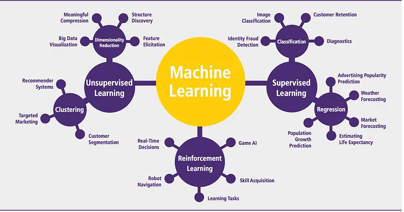

# Introduction to Machine Learning  
## A Systems and Application-Oriented Perspective

---

## Learning outcomes

After completing this module, learners will be able to:

- Explain machine learning using real-world intuition.
- Distinguish machine learning from traditional rule-based systems.
- Identify major categories of machine learning and their applications.
- Understand the end-to-end workflow of a machine learning system.
- Interpret model performance measures at a conceptual level.
- Recognise practical data-related challenges in machine learning.

---

## 1. Understanding Machine Learning

Machine learning is a subfield of artificial intelligence that enables systems to
learn from data and improve their performance on a task without being explicitly
programmed with fixed rules.

Traditional software systems rely on predefined instructions written by humans.
In contrast, machine learning systems **learn patterns from historical data** and
use those patterns to make predictions or classifications on new, unseen data.

For example:
- Instead of writing rules to identify spam emails, a machine learning system
  learns from thousands of past emails labelled as spam or not spam.
- Instead of manually defining customer risk categories, a machine learning
  model identifies risk patterns from past customer behaviour.

Machine learning is therefore most useful in situations where:
- The number of influencing factors is large
- Relationships between variables are complex
- Behaviour changes over time

---

## 2. Machine Learning as a System

In real-world applications, machine learning does not operate as a standalone
model. It is embedded within a larger system that supports decisions or actions.

A typical machine learning system includes multiple interconnected components:

| Component | Explanation |
|---------|-------------|
| Problem definition | Specifies what outcome or decision the system supports |
| Data sources | Historical records used for learning |
| Feature representation | Structured form of raw data |
| Model | Learns relationships from data |
| Output | Predictions, scores, or classifications |
| Decision process | Actions taken based on outputs |
| Feedback loop | Learning from outcomes over time |

The effectiveness of machine learning depends not only on the model, but on how
well these components are aligned.

---

## 3. Rule-Based Systems and Their Limitations

Before machine learning became widely used, many automated systems relied on
explicit rules defined by domain experts.

Examples of such rules include:
- “If credit score < 600, reject the loan”
- “If attendance < 75%, issue a warning”

While rule-based systems are transparent and easy to control, they have several
limitations:

| Aspect | Rule-Based Systems | Machine Learning Systems |
|------|------------------|-------------------------|
| Adaptability | Static rules | Learns from new data |
| Complexity handling | Limited | Handles complex interactions |
| Maintenance | Manual updates | Data-driven updates |
| Scalability | Difficult at scale | Naturally scalable |

Machine learning is especially valuable when simple rules fail to capture real
world variability.

---

## 4. Problem Formulation in Machine Learning

The way a machine learning problem is framed directly affects the usefulness of
the resulting model.

Consider the following formulations:

| Formulation | Implication |
|------------|-------------|
| Predict customer churn | Produces probabilities |
| Identify customers at high risk of churn | Enables targeted intervention |
| Forecast sales | Produces numeric estimates |
| Forecast sales to plan inventory | Supports operational decisions |

Effective problem formulation ensures that predictions translate into meaningful
outcomes.

---

## 5. Categories of Machine Learning

Machine learning methods are broadly classified based on the availability of
outcome information.

---

### 5.1 Supervised Learning

Supervised learning uses labeled data, where the correct output is known.

The model learns a mapping between inputs and outputs.

| Task Type | Output | Typical Use |
|---------|--------|------------|
| Classification | Discrete categories | Churn, fraud, approval |
| Regression | Continuous values | Sales, demand, pricing |

Supervised learning is widely used when historical outcomes are available and
reliable.

---

### 5.2 Unsupervised Learning

Unsupervised learning works with unlabeled data and focuses on discovering
patterns or structure.

| Task | Purpose | Example |
|----|--------|--------|
| Clustering | Group similar observations | Customer segmentation |
| Association analysis | Identify co-occurrence patterns | Product bundling |
| Dimensionality reduction | Simplify complex data | Visualization |

Unsupervised learning is often used for exploration and insight generation.

---

### 5.3 Reinforcement Learning

Reinforcement learning involves an agent that learns by interacting with an
environment and receiving feedback in the form of rewards.

| Concept | Description |
|-------|-------------|
| Agent | Makes decisions |
| Environment | Responds to actions |
| Reward | Evaluates outcomes |

The goal is to learn a strategy that maximizes long-term rewards rather than
immediate outcomes.

---

## 6. The Machine Learning Workflow

Machine learning systems typically follow a structured workflow:

| Stage | Description |
|-----|-------------|
| Objective definition | Identify what is to be predicted |
| Data understanding | Explore available variables |
| Data preparation | Handle missing values and outliers |
| Model training | Learn patterns from data |
| Evaluation | Measure performance |
| Deployment | Use model outputs in practice |
| Monitoring | Track changes over time |

This workflow is iterative rather than linear.

---

## 7. Evaluating Machine Learning Models

Model performance must be interpreted relative to the problem being solved.

Common evaluation measures include:

| Metric | Interpretation |
|------|----------------|
| Accuracy | Overall correctness |
| Precision | Reliability of positive predictions |
| Recall | Ability to identify true positives |
| F1-score | Balance between precision and recall |
| RMSE / MAE | Average prediction error |

Different metrics highlight different types of errors.

---

## 8. Data-Related Challenges

Machine learning systems are only as reliable as the data they learn from.

Common challenges include:

| Challenge | Impact |
|---------|--------|
| Missing data | Loss of information |
| Outliers | Distorted learning |
| Class imbalance | Misleading accuracy |
| Bias | Unfair outcomes |
| Data drift | Performance degradation |

Addressing these challenges is critical for maintaining model reliability.

---

## Conclusion

Machine learning enables systems to learn from data and support decisions in
complex environments. Its effectiveness depends not only on algorithms, but also
on how problems are framed, how data is managed, and how models are evaluated and
maintained.

A strong conceptual foundation is essential before moving to implementation and
advanced techniques.
